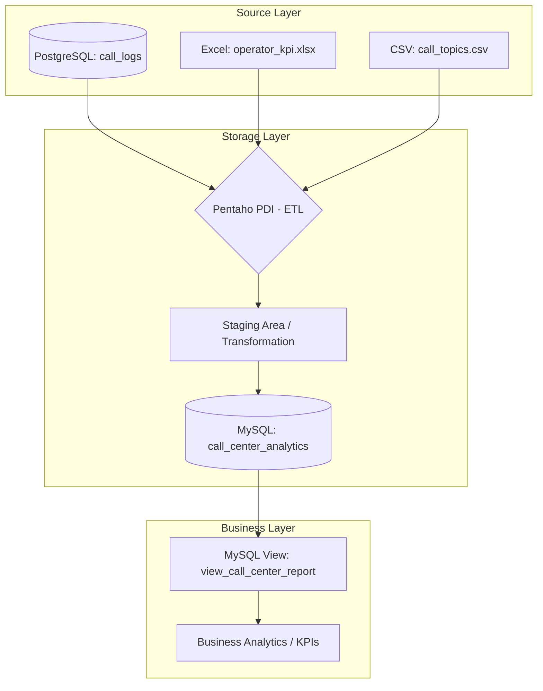

# Лабораторная работа №3. Интеграция данных из нескольких источников. Обработка и согласование данных из разных источников

**Цель работы.** Разработать комплексное ETL-решение для интеграции данных из локальной СУБД PostgreSQL и файловых источников (CSV/Excel) в целевое хранилище MySQL. Спроектировать верхнеуровневую архитектуру аналитического решения.

## Вариант 18

Оценка эффективности КЦ. Сопоставить длительность звонка с тематикой и рейтингом оператора.

Call-центр.
PostgreSQL: Журнал звонков.
Excel: Оценки операторов (KPI).
CSV: Тематика обращений.

# Ход работы

## Шаг 1. Архитектура решения



## Шаг 2. Создание таблицы и её заполнение в PostgreSQL:

### Создание таблицы (call_logs):

```sql
CREATE TABLE call_logs (
    call_id SERIAL PRIMARY KEY,
    operator_id INT,
    call_date TIMESTAMP,
    duration_sec INT
);
```


Вид таблицы:


## Шаг 3. Разработка трансформации в Pentaho (Spoon)

Общий вид трансформации:


### Настройка основных узлов

#### Подключение PostgreSQL:


#### Подключение файлов:


#### Фильтрация:

- Условие: `duration_sec > 540` (фильтрация 1 млн строк до ~100 тыс. целевых записей).

## Шаг 4. Создание витрины данных (MySQL View)
Создание основной таблицы:
```sql
CREATE TABLE IF NOT EXISTS call_center_analytics (
    call_id INT PRIMARY KEY,
    operator_name VARCHAR(255),
    kpi_score DECIMAL(3, 2),
    topic_name VARCHAR(100),
    call_date TIMESTAMP,
    duration_sec INT
);
```


Вид таблицы:

```sql
CREATE OR REPLACE VIEW view_call_center_report AS
SELECT
    topic_name,
    CASE
        WHEN kpi_score >= 4.5 THEN 'High Performing'
        WHEN kpi_score >= 3.0 THEN 'Standard'
        ELSE 'Needs Improvement'
    END AS operator_performance_category,
    AVG(duration_sec) as avg_duration,
    COUNT(*) as total_calls
FROM call_center_analytics
GROUP BY topic_name, operator_performance_category;
```

