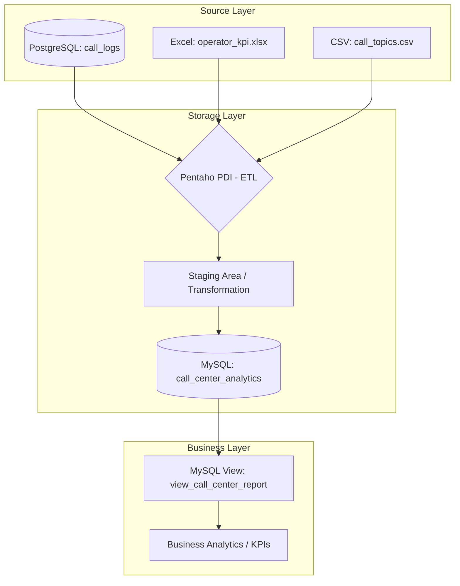

# Architecture Diagram (Variant 18: Call-center)

## Layers Description

### 1. Source Layer
- **PostgreSQL**: Stores raw call logs (call_id, operator_id, timestamp, duration).
- **Excel**: Provides operator KPIs and names.
- **CSV**: Contains metadata about call topics tied to call_id.

### 2. Storage Layer
- **Pentaho PDI (Spoon)**: Orchestrates the ETL process:
    - Extracts data from all three sources.
    - Joins data using `operator_id` and `call_id`.
    - Cleans data (removes nulls, validates types).
- **MySQL**: The target data warehouse storing the integrated dataset in the `call_center_analytics` table.

### 3. Business Layer
- **MySQL View**: A pre-calculated report that averages call duration by topic and operator ranking.
